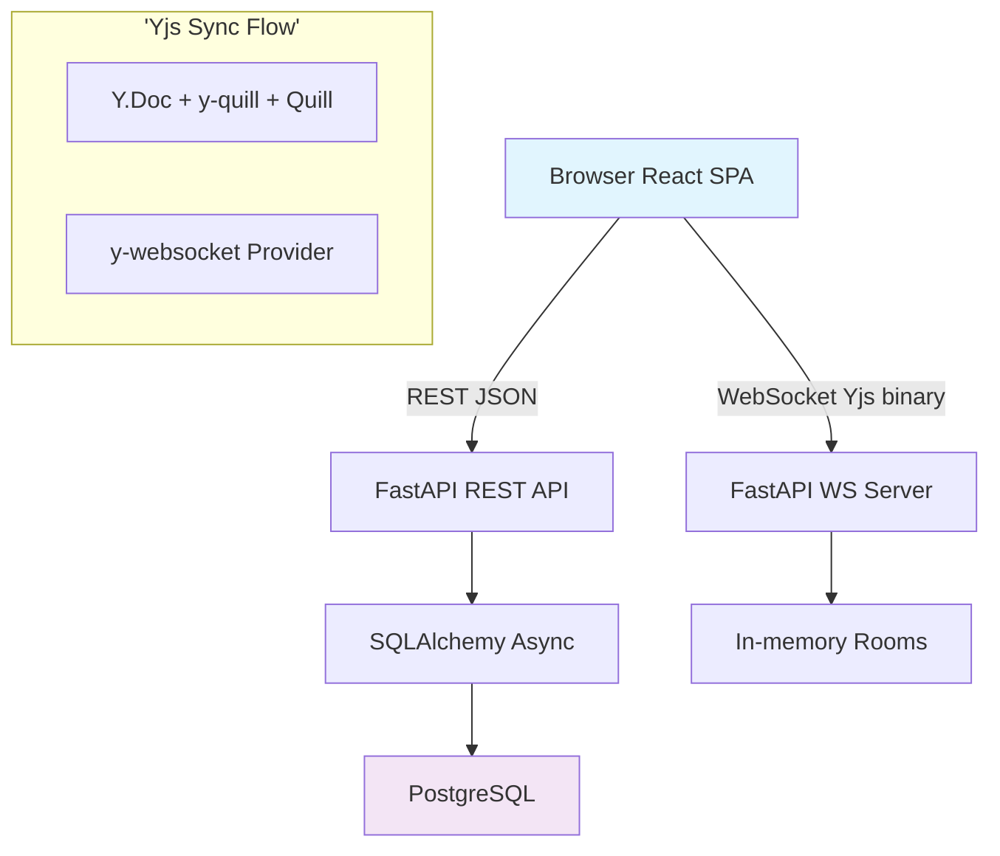
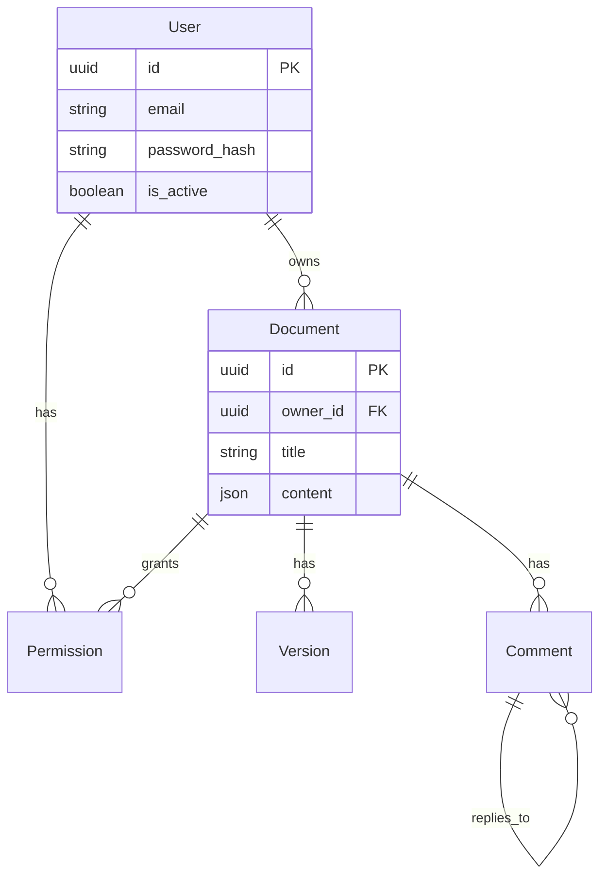

# 🗃️ CollabDocs - Real-Time Collaborative Document Editor

<div align='center'>


[](https://fastapi.tiangolo.com)
[](https://reactjs.org)
[](https://postgresql.org)
[](https://yjs.dev)
[](LICENSE)

**A Google Docs-style collaborative editor with real-time sync, version history, comments, and role-based access control.**

[Features](#features) · [Architecture](#architecture) · [Quick Start](#quick-start) · [API Reference](#api-reference) · [Contributing](#contributing)

</div>

---

## 📋 Table of Contents

- [Overview](#overview)
- [✨ Features](#features)
- [🛠️ Tech Stack](#tech-stack)
- [🏗️ Architecture](#architecture)
  - [System Diagram](#system-diagram)
  - [Project Structure](#project-structure)
  - [Data Flow](#data-flow)
- [🗄️ Database Schema](#database-schema)
- [📡 API Reference](#api-reference)
- [🔌 WebSocket Protocol](#websocket-protocol)
- [🚀 Quick Start](#quick-start)
  - [Prerequisites](#prerequisites)
  - [Backend Setup](#backend-setup)
  - [Frontend Setup](#frontend-setup)
  - [Environment Variables](#environment-variables)
- [🔐 Authentication](#authentication)
- [👑 Permissions & Roles](#permissions--roles)
- [🔄 Real-Time Collaboration](#real-time-collaboration)
- [📚 Version History](#version-history)
- [💬 Comments System](#comments-system)
- [🔒 Security](#security)
- [🐛 Development Guide](#development-guide)
- [🚢 Deployment](#deployment)
- [🤝 Contributing](#contributing)
- [📄 License](#license)

---

## 🎯 Overview

**CollabDocs** is a full-stack, real-time collaborative document editor inspired by Google Docs. Multiple users can:

- ✅ Edit documents simultaneously with live cursors/avatars
- ✅ Leave threaded comments anchored to text
- ✅ Restore full version history  
- ✅ Share with granular RBAC (Owner/Editor/Viewer)
- ✅ Work offline (Yjs syncs on reconnect)

**Backend**: Python FastAPI (REST + WebSocket) + PostgreSQL  
**Frontend**: React 19 + Vite + MUI + Quill + Yjs CRDT  
**Core Innovation**: [Yjs](https://yjs.dev) Conflict-free Replicated Data Types eliminate edit conflicts

---

## ✨ Features

| Category | Feature |
|----------|---------|
| **Editor** | Rich-text (headings, bold, lists, links) via [Quill.js 2](https://quilljs.com) |
| **Collaboration** | Real-time multi-user sync via [Yjs CRDT](https://yjs.dev) |
| **Presence** | Live cursor positions + user avatars |
| **Persistence** | Auto-save every 2s (debounced) to PostgreSQL |
| **Offline** | Yjs buffers changes locally, syncs on reconnect |
| **Auth** | JWT register/login (bcrypt + python-jose) |
| **Permissions** | Owner/Editor/Viewer RBAC per document |
| **Sharing** | Share via email with role assignment |
| **Versions** | Named snapshots + one-click restore |
| **Comments** | Threaded + anchored to text selections |
| **UI** | Material UI v7 + responsive design |

---

## 🛠️ Tech Stack

### Backend
| Layer | Technology | Purpose |
|-------|------------|---------|
| Framework | [FastAPI](https://fastapi.tiangolo.com) | Async REST + WebSocket |
| ORM | [SQLAlchemy 2 async](https://sqlalchemy.org) | DB models/queries |
| Database | [PostgreSQL](https://postgresql.org) | Storage |
| Driver | [asyncpg](https://github.com/MagicStack/asyncpg) | Async Postgres |
| Auth | [python-jose](https://github.com/mpdavis/python-jose) + [passlib](https://passlib.readthedocs.io) | JWT + bcrypt |
| Validation | [Pydantic](https://pydantic.dev) v2 | Schemas |
| Server | [Uvicorn](https://www.uvicorn.org) | ASGI |

### Frontend 
| Layer | Technology | Purpose |
|-------|------------|---------|
| Framework | [React 19](https://react.dev) | UI |
| Bundler | [Vite 5](https://vite.dev) | Dev/build |
| Editor | [Quill 2](https://quilljs.com) | Rich text |
| CRDT | [Yjs 13](https://yjs.dev) + [y-websocket](https://github.com/yjs/y-websocket) | Real-time sync |
| UI | [MUI 7](https://mui.com) | Components |
| State | [Zustand 5](https://zustand.docs.pmnd.rs) | Global state |
| Router | [React Router 7](https://reactrouter.com) | SPA routing |

---

## 🏗️ Architecture

### System Diagram



### Project Structure

```
.
├── backend/                    # FastAPI API
│   ├── app/
│   │   ├── main.py            # App factory + routers
│   │   ├── core/              # Config, DB, security
│   │   ├── models/            # SQLAlchemy: User/Document/etc
│   │   ├── schemas/           # Pydantic DTOs
│   │   ├── repositories/      # DB access layer
│   │   ├── services/          # Business logic
│   │   └── api/
│   │       ├── v1/endpoints/  # REST controllers
│   │       └── v1/websocket/  # WS endpoint
│   ├── requirements.txt
│   └── .env (create from .env.example)
│
├── frontend/my-app/           # React + Vite SPA
│   ├── src/
│   │   ├── components/        # UI: Editor/Presence/Comments
│   │   ├── hooks/             # useAuth/useDocument/useWebSocket
│   │   ├── pages/             # Dashboard/DocumentEditor
│   │   ├── services/          # API wrappers
│   │   ├── store/             # Zustand stores
│   │   └── utils/
│   ├── package.json
│   └── vite.config.js
└── README.md                  # This file!
```

---

## 🗄️ Database Schema

6 Tables with relationships:



**Key Design:**
- `content`: Quill Delta JSON (preserves formatting)
- `permissions`: `(document_id, user_id)` UNIQUE → one role/user/doc
- Owner always has implicit full control

---

## 📡 API Reference

**Base:** `http://localhost:8000/api/v1`

**Auth:** `Authorization: Bearer <jwt>`

| Method | Endpoint | Description |
|--------|----------|-------------|
| POST | `/auth/register` | Create user |
| POST | `/auth/login` | JWT token |
| GET | `/documents/` | List docs (`?skip=0&limit=50`) |
| POST | `/documents/` | Create doc |
| GET/PUT/DEL | `/documents/{id}` | CRUD |
| POST | `/documents/{id}/share` | Share w/ email + role |

**Full OpenAPI:** `http://localhost:8000/docs`

---

## 🔌 WebSocket Protocol

**Connect:** `ws://localhost:8000/ws/{doc_id}?token=<jwt>`

**Flow:**
```
Client WS?token=jwt ──→ Server validates → Room join
     ↕ Yjs binary sync (no JSON!)
     ↕ Awareness: cursors/colors
```

**Why query token?** Browsers can't set `Authorization` on WS upgrade.

---

## 🚀 Quick Start

### Prerequisites
- Python 3.11+, Node 18+, PostgreSQL 15+

### Backend Setup
```bash
cd backend
python -m venv venv && source venv/bin/activate  # venv\Scripts\activate (Win)
pip install -r requirements.txt
cp .env.example .env  # Edit: SECRET_KEY, POSTGRES_PASSWORD
psql -U postgres -c "CREATE DATABASE editor_db;"
uvicorn app.main:app --reload --host 0.0.0.0 --port 8000
```

**API:** http://localhost:8000/docs

### Frontend Setup
```bash
cd frontend/my-app
npm install
npm run dev  # http://localhost:3000
```

### Verify
Register → Create doc → Share → Open 2 tabs → Edit live!

---

## 🔧 Environment Variables

**backend/.env:**
```
SECRET_KEY=your-256bit-hex-secret!!  # python -c "import secrets; print(secrets.token_hex(32))"
POSTGRES_PASSWORD=securepassword      # NOT '123'!
POSTGRES_SERVER=localhost
POSTGRES_USER=postgres
POSTGRES_DB=editor_db
ACCESS_TOKEN_EXPIRE_MINUTES=30
```

**frontend/my-app/.env:**
```
VITE_API_URL=http://localhost:8000/api/v1
VITE_WS_URL=ws://localhost:8000/ws
```

---

## 🔐 Authentication

**JWT Flow:**
1. POST `/auth/login` → `{access_token, user}`
2. Axios interceptor adds `Bearer`
3. WS: `?token=...`
4. `AuthMiddleware` → `request.state.user`
5. `get_current_user()` resolves User model

**Security:** 30min expiry, bcrypt-12, inactive users blocked.

---

## 👑 Permissions & Roles

| Role | Edit | Share | Delete |
|------|------|-------|--------|
| Owner | ✅ | ✅ | ✅ |
| Editor | ✅ | ❌ | ❌ |
| Viewer | ❌ | ❌ | ❌ |

**Share:** `POST /docs/{id}/share {user_email, role}` → Upsert.

---

## 🔄 Real-Time Collaboration

**[Yjs CRDT](https://yjs.dev):** Conflict-free edits.

**Stack:**
- `Y.Doc.getText('quill')` ←→ `y-quill` ←→ Quill editor
- `WebsocketProvider` syncs binary diffs
- `awareness` → PresenceAvatars

**Auto-save:** Quill `text-change` → debounce 2s → POST content JSON.

**Offline:** Local Y.Doc buffers → sync on reconnect.

---

## 📚 Version History

`POST /versions/doc/{id}?comment=...` → Snapshot `documents.content`

**Restore:** `POST /versions/{vid}/restore?doc_id=...` → New version + DB update.

*Note: Restore requires page refresh for live collaborators.*

---

## 💬 Comments System

**Threaded + Anchored:**
```json
{
  "document_id": "...",
  "content": "Fix this",
  "selection": {"index": 42, "length": 5},
  "parent_id": null  // or reply UUID
}
```

Resolve/unresolve via API.

---

## 🔒 Security

✅ **bcrypt** passwords  
✅ **JWT** stateless auth  
✅ **Pydantic** validation  
✅ **SQLAlchemy** parameterized queries  
✅ **CORS** localhost:3000  
⚠️ **Prod:** HTTPS + short JWT expiry + Redis pub/sub for scale

---

## 🐛 Development Guide

```bash
# Lint
cd backend && ruff check app/
cd ../frontend/my-app && npm run lint

# Test backend/frontend (add pytest/vitest)
```

**Add endpoint:** schema → repo → service → controller → main.py router.

---

## 🚢 Deployment

**Backend:** `gunicorn -w 4 -k uvicorn.workers.UvicornWorker app.main:app`

**Frontend:** `npm run build` → static host

**Nginx + WS:**
```nginx
location /ws/ {
    proxy_pass http://backend:8000;
    proxy_http_version 1.1;
    proxy_set_header Upgrade $http_upgrade;
    proxy_set_header Connection "upgrade";
}
```

---

## 🤝 Contributing

1. Fork → `git checkout -b feature/xyz`
2. Lint → Test → PR with clear description
3. Follow [FastAPI style](https://fastapi.tiangolo.com/tutorial/)

**Issues?** Include steps + browser/server logs.

---

## 📄 License

MIT - see [LICENSE](LICENSE)

<div align='center'>

⭐ **Star to support** · **Built with ❤️ + FastAPI + Yjs**

</div>

**TODO.md updated:** Step 1 ✅

